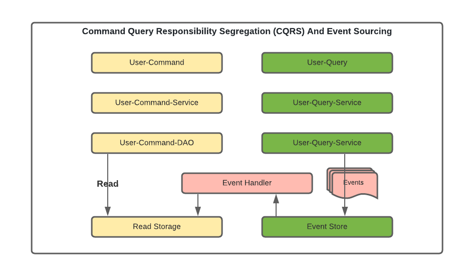

# springboot-cqrs-pattern 
### Pattern: Command Query Responsibility Segregation (CQRS)
SpringBoot with CQRS MicroService pattern

What is CQRS pattern ?

The Command Query Responsibility Segregation (CQRS) pattern propose separating the write model, and the read data model.
* Commands are method whose sole purpose is performing an action. Simply put, commands like for responsible for creating, updating, and deleting tasks
(write operations)
* Queries are methods that are only able to read and return data without modifying it.

In essence, CQRS takes microservices to the next level by splitting CRUD operations into two independent models that can be managed separately

The application will offer CRUD operations on the domain model and will also feature a persistence for the domain objects. CRUD stands for Create, Read, Update, and Delete, which are basic operations that we can perform on a domain object
DDD addresses the analysis and design of software that relies on complex domain-specific knowledge. It builds upon the idea that software systems need to be based on a well-developed model of a domain. DDD was first prescribed by Eric Evans as a catalog of patterns.
We'll be using some of these patterns to build our example.

* Domain Model: The read and write operations are happening over the same domain model. While this is not a problem for a simple domain model like this, it may worsen as the domain model gets complex. We may need to optimize our domain model and the underlying storage for them to suit the individual needs of the read and write operations.
* Persistence: The persistence we have for our domain objects stores only the latest state of the domain model. While this is sufficient for most situations, it makes some tasks challenging. For instance, if we have to perform a historical audit of how the domain object has changed state, it's not possible here. We have to supplement our solution with some audit logs to achieve this.

we'll separate the domain model and its persistence to handle write and read operations

Aggregate/Aggregator: 
Aggregate is a pattern described in Domain-Driven-Design (DDD) that logically groups different entities by binding entities to an aggregate root.

CQRS naturally benefits from the aggregate pattern, which groups write model, providing transaction guarantees. Aggregates normally hold the cache for better performance. 

Projection/Projector: Projection is another important pattern which great feature of CQRS. Projection representing different objects shapes and structures.

