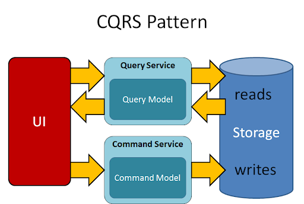

# springboot-cqrs-pattern 
### Pattern: Command Query Responsibility Segregation (CQRS)
SpringBoot with CQRS MicroService pattern

What is CQRS pattern ?

The Command Query Responsibility Segregation (CQRS) pattern propose separating the write model, and the read data model.
* Commands are method whose sole purpose is performing an action. Simply put, commands like for responsible for creating, updating, and deleting tasks
(write operations)
* Queries are methods that are only able to read and return data without modifying it.

In essence, CQRS takes microservices to the next level by splitting CRUD operations into two independent models that can be managed separately

